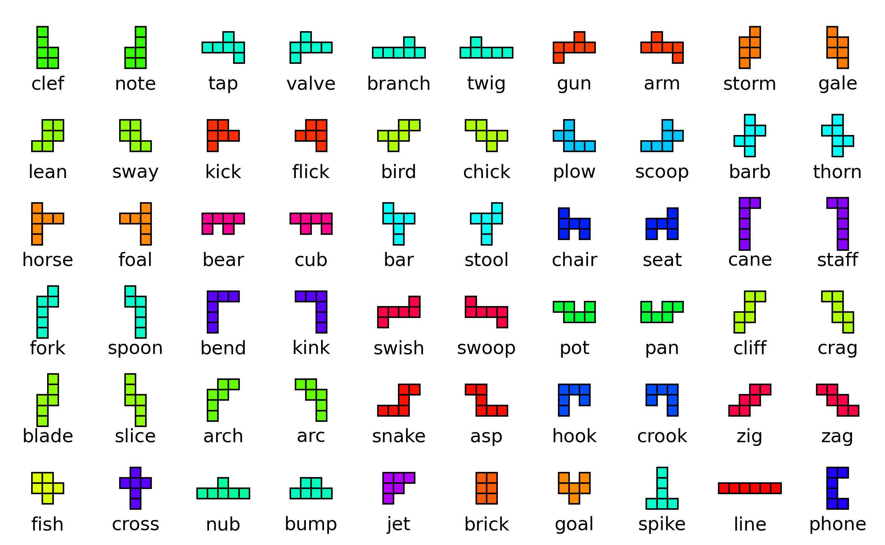
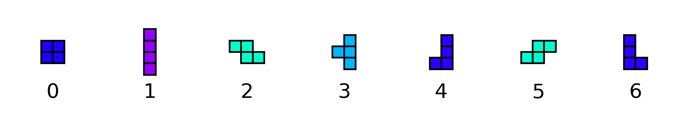
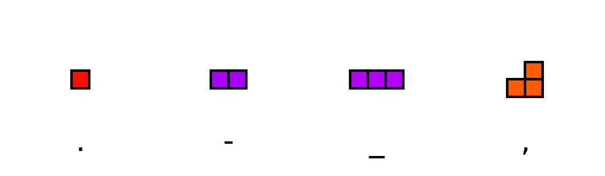

# Hexomino naming

I was watching [this video](https://youtu.be/39YYZcwCuv0?si=u7-G3ntPZl3g7kQj&t=658) when the creator mentioned that the hexominoes didn't have official names. I looked around and I saw a [couple of](https://gamepuzzles.com/sxnames.htm) [attempts](https://conwaylife.com/wiki/Polyomino) to assign letters or names to the free
hexominoes, but I felt unsatisfied.

I always liked the tetris pieces and their lettering.

And the tetris pieces are one-sided, i.e. they distinguish between reflections, but not rotations. 

The pentominoes are also named with letters, and all of them pretty much look like their letters too. A couple of the chiral pentominoes have reflections with obvious letters, a couple are listed on wikipedia as `A'` where `A` is the reflection. I came up with some reasonable substitutes which are a bit of a stretch, but I like that they all have names.

But there are 35 free hexominoes, which can be given letters if you add some complexity, but I wanted to name all 60 one-sided hexominoes, which would take more than all the lower and uppercase letters. So I decided to use one-syllable words to describe their shapes. I like this as a solution because it makes them visual and memorable, and the reflections can have related names, and also they can coexist with the pentominoes or tetrominoes without overlap.

The first 50 are all pairs, and I tried to name them such that the one 'facing' to the right (no hard and fast rule, just off vibes and what I'm picturing them as) has a name which is in some way before, more common, larger, or senior to the one facing to the left. For instance, the animals I tried to name with adult and child terms ('chick' for bird child isn't universal but is cute, and 'asp' is just another more obscure term for some kinds of snake) The naming process involved a lot of googling '______ synonyms' but I think it turned out ok!

Oh, also if you want all the polyominoes up to n = 6 in one unified system, I propose this:

4 is a stretch, but the rest of them fit so well that I'm ok with it.

Maybe replace underscore with exclamation point...
maybe I'll do the septominoes next.. how many of those are there? 196 feels doable with two-syllable words.